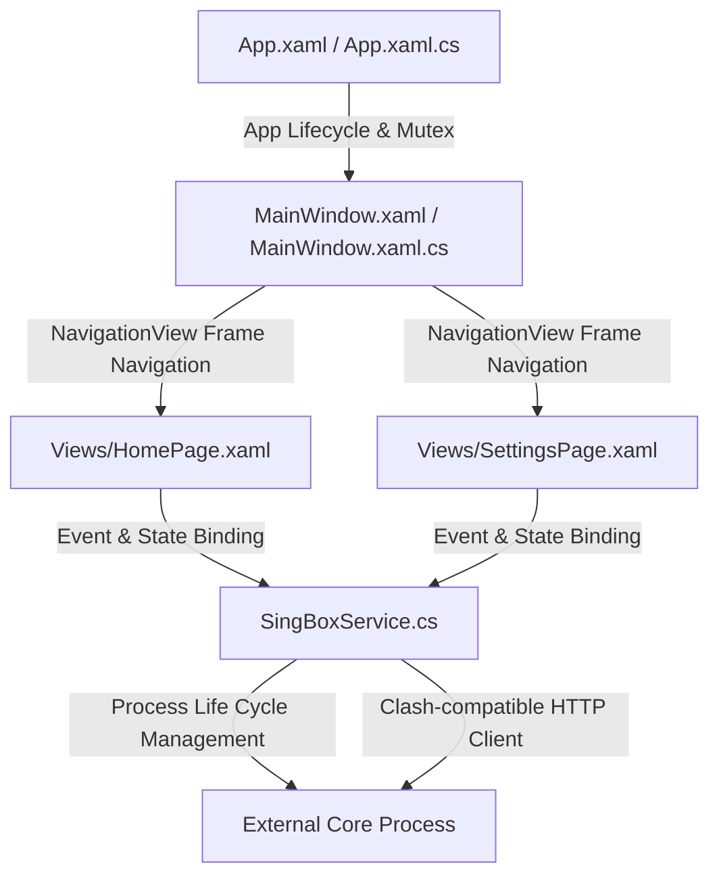

# sinbox - WPF Desktop Client Frontend

A modern, high-performance Windows desktop client frontend built on **.NET 8.0** and the **WPF** framework, utilizing **WPF-UI** for premium Fluent Design aesthetics.

---

## 🛠️ Technical Architecture

The application adopts a decoupled, event-driven MVVM-lite architecture:



### 1. Presentation Layer (WPF & WPF-UI)
* **Custom TitleBar**: Integrated native Win32 non-client area drag-and-drop support with custom vector brand styling (`sinbox`) and standard clickable controls.
* **Layout Sizing**: A modern 30% scaled compact left NavigationView sidebar (`CompactPaneLength="83"`, item `Height="52"`) housing type-safe, multi-colored gradient vector icons (`ui:ImageIcon` holding vector `DrawingImage` paths).
* **Text Formatting**: Sharp, pixel-perfect text rendering optimized for modern high-DPI Windows systems via layout rounding and ClearType screen alignment (`UseLayoutRounding="True"`, `TextOptions.TextFormattingMode="Display"`, `TextOptions.TextRenderingMode="ClearType"`).
* **Apple-Style Slide Switch**: Interactive 2x-scaled sliding ToggleButton customized with standard WPF control templates and double-storyboard animations.

### 2. Service & Process Management Layer (`SingBoxService.cs`)
* **Process Lifecycle**: Implements external core process execution, redirecting standard input/output streams to a thread-safe circular log buffer.
* **API Communication**: Decouples network communication through an HTTP client, parsing core statuses via high-performance `System.Text.Json` DOM APIs.
* **Single Instance Protection**: Utilizes thread-safe operating system `Mutex` locking on application startup to enforce single-instance integrity and prevent resource conflicts.

### 3. Build & Deployment Pipeline (Portable Folder Distribution)
* **Side-by-side DLL Mapping**: Configured with `<PublishSingleFile>false</PublishSingleFile>` and `<SelfContained>true</SelfContained>` in `.csproj`.
* **Launch Performance**: Leverages side-by-side DLL layout, allowing the Windows PE loader to map runtime dependencies directly from the application folder. This completely bypasses temp-folder extraction and real-time antivirus scans, delivering sub-100ms startup speeds.
* **Auto-Copy Target**: Built-in MSBuild target `AutoCopyToDistribution` automatically compiles and packages the binary host along with all necessary runtime resources into the target distribution folder upon executing `dotnet publish -c Release`.

---

## 📂 Codebase Directory Structure

```text
.
├── App.xaml                   # Global styles & WPF-UI theme dictionaries
├── App.xaml.cs                # Entry point, Mutex checks & exception logging
├── MainWindow.xaml            # Main shell, custom TitleBar & NavigationView
├── MainWindow.xaml.cs         # Coordinates, system tray setup & window brushes
├── SingBoxService.cs          # Core process management & API interface
├── SingBoxTrayApp.csproj      # Build options & automated copying target
├── app.manifest               # UAC administrative elevation settings
├── icon.ico                   # Standard PE application metadata icon
├── icon.png                   # Transparent loss-less vector-rendered branding logo
├── icon.svg                   # Vector graphics source (1027x1150 layout)
└── Views/
    ├── HomePage.xaml          # Switch control, performance metrics & node cards
    ├── HomePage.xaml.cs       # Live search filter & speed testing event bindings
    ├── SettingsPage.xaml      # Subscription source & console log viewer
    └── SettingsPage.xaml.cs   # Log buffer clipboard bindings
```

---

## 🚀 How to Build & Publish

To compile and package the portable client, execute:

```powershell
dotnet publish -c Release
```

The MSBuild pipeline will automatically:
1. Compile the self-contained WPF target.
2. Output a standalone folder containing `singbox.exe` and its dependencies.
3. Automatically copy the published files and resources into the final target distribution directory.
